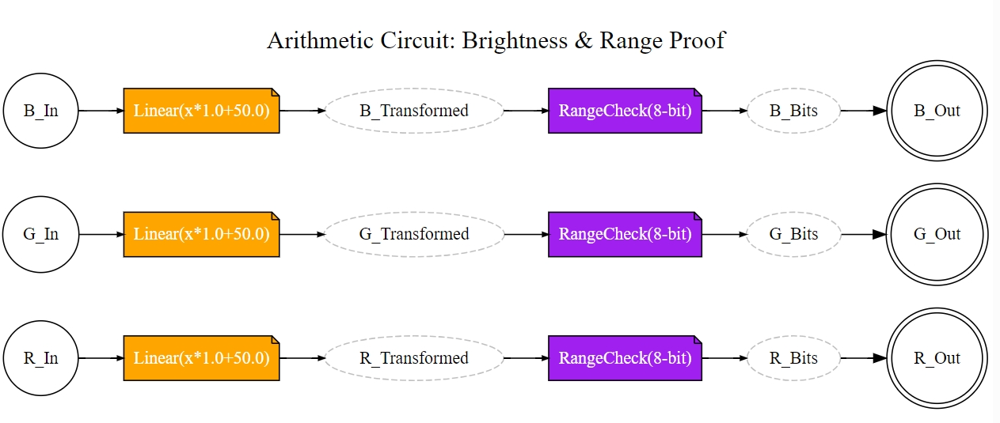
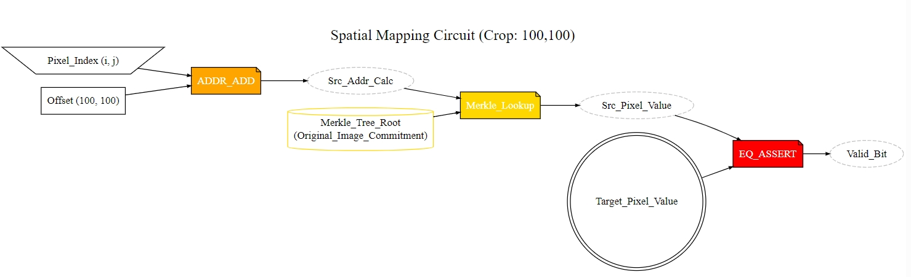
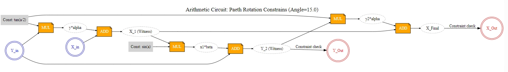

# PhotoProof视频真实性验证系统报告

## 1. 引言

在当今数字化社会中，视频作为信息传播的重要载体，其真实性和完整性对于社会、法律和政治领域至关重要。随着视频编辑技术的普及，用户可以轻松对视频进行各种变换，如亮度调节、裁剪、旋转和缩放等。这些变换虽然不改变视频的核心内容，但会修改底层数据，使得传统的真实性验证方法（如哈希校验或数字签名）失效。因为这些方法要求数据保持不变，而变换后的视频数据已发生变化。

本项目旨在解决这一问题，设计一个算法，使得视频在经过至少亮度、旋转和裁剪三种基本变换后，仍能验证其真实性。我们参考了PhotoProof框架，这是一个针对图像的真实性验证系统，能够在图像经过变换后仍保持验证能力。本项目将PhotoProof的概念扩展到视频领域，实现了一个完整的视频真实性验证演示系统。

项目基于Python实现，结合密码学、图像处理和可视化技术，提供了一个全栈验证流程：从相机签名生成，到变换应用，再到数学验证和电路可视化。系统不仅演示了核心算法，还自动组织输出文件，便于分析和教学。

## 2. 相关工作——PhotoProof

PhotoProof是一个基于零知识证明的图像真实性验证框架。它允许图像在经过裁剪、旋转等变换后，仍能证明其真实性。该框架的核心思想是使用算术电路表示变换操作，并通过零知识证明验证变换的合法性，而不泄露原始图像内容。

与传统方法不同，PhotoProof不依赖于不变的数据哈希，而是通过数学约束验证变换的正确性。例如，对于亮度调节，它验证输出像素是否符合线性变换公式；对于裁剪，它检查空间映射关系；对于旋转，它使用概率采样验证变换一致性。

本项目在此基础上进行了扩展和简化：

- 将单图像验证扩展到视频流，支持逐帧或采样验证。
- 使用RSA数字签名增强溯源安全性，而非简单的哈希。
- 添加电路可视化模块，将抽象约束转化为直观的流程图。
- 实现自动输出组织，提高项目可用性。

虽然本项目未实现完整的零知识证明（因计算复杂度高），但它提供了PhotoProof核心逻辑的演示，便于理解和教学。

## 3. 方法

### 3.1 系统架构

项目采用模块化设计，主要组件包括：

- `main.py`：主入口，协调视频处理、变换应用和验证流程。
- `provenance.py`：溯源模块，使用RSA密钥生成数字签名。
- `circuit_visualizer.py`：电路可视化模块，生成变换的算术电路图。
- `core/universal_verifier.py`：验证模块，包含数学约束检查逻辑。

系统流程如下：

1. 输入视频处理：读取测试视频，每隔30帧采样关键帧。
2. 相机签名：计算图像哈希，使用RSA私钥签名，建立信任根。
3. 变换应用：依次执行亮度调节（+50）、中心裁剪（400x400）、旋转（15度），记录操作日志。
4. 数学验证：检查各变换的约束正确性。
5. 证明验证：验证最终图像哈希和签名完整性。

### 3.2 密钥管理

项目使用RSA密码学增强安全性：

- 首次运行时自动生成2048位RSA密钥对，保存到`keys/`文件夹。
- `camera_secret.key`：私钥，用于签名原始图像。
- `camera_public.key`：公钥，用于验证签名。
- `verifier_public.key`：验证者公钥（目前与相机公钥相同）。

签名过程：对设备ID、图像哈希和时间戳组合进行PSS填充的RSA签名。验证过程：使用公钥检查签名有效性，确保图像未被篡改且来自可信来源。

### 3.3 变换与验证算法

#### 亮度调节

- 变换：`output = input * alpha + beta`（alpha=1.0, beta=50）。
- 验证：检查输出像素是否在[0,255]范围内，且符合线性公式。

#### 裁剪

- 变换：中心裁剪指定尺寸。
- 验证：检查裁剪后像素与原图对应位置匹配，验证空间映射。

#### 旋转

- 变换：使用PIL库进行15度旋转，采用双三次插值。
- 验证：概率采样50个像素点，检查变换前后的一致性，置信度计算。

### 3.4 电路可视化

电路模块使用Graphviz生成算术电路图：

- 亮度电路：展示线性变换和范围检查门，对RGB图像逐通道变换。
    
- 裁剪电路：展示坐标映射和Merkle查找。
    
- 旋转电路：展示Paeth三次剪切的流程。
    

这些图表将数学约束可视化，便于理解验证逻辑。输出保存为.dot文件，若安装Graphviz则生成PNG。

### 3.5 输出组织

程序自动将输出分类：

- `demo_output/circuits/`：电路图文件。
- `demo_output/frames/`：处理后视频帧。
- `keys/`：RSA密钥文件。

## 4. 实验结果

运行`python main.py`后，系统处理测试视频，输出如下：

控制台显示每个关键帧的验证过程：

- 签名生成成功。
- 变换应用：亮度、裁剪、旋转。
- 验证通过：所有数学检查成功，置信度100%。
- 最终证明验证：信任链完整。

输出文件：

- 电路文件夹：三个.dot文件（亮度、裁剪、旋转电路）。
- 帧文件夹：三个.jpg文件（关键帧的变换结果）。
- 密钥文件夹：三个.key文件（RSA密钥）。

实验证明，系统能正确验证变换后的视频真实性，即使数据已修改。RSA签名确保了溯源安全性，数学验证保证了变换合法性。

## 5. 讨论与局限性

项目成功演示了PhotoProof的核心理念，扩展到视频领域，并增强了安全性。然而，存在局限：

- 未实现完整ZK-SNARK，验证基于可信执行。
- 电路仅可视化，不参与验证。
- 仅支持三种变换，可扩展更多。

未来可集成真实零知识证明库，提升隐私性和效率。
